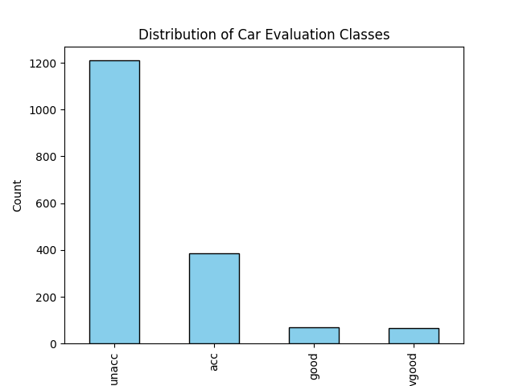
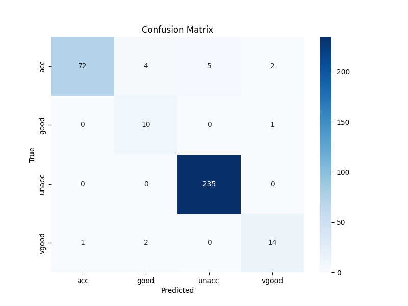
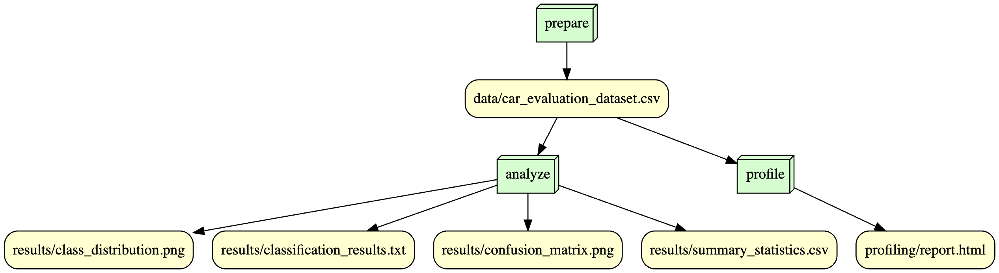

# IS-477 Fall 2023 Final Project - Car Evaluation
[](https://zenodo.org/doi/10.5281/zenodo.10258395)
## Overview

This repository contains the final project for the IS-477: Data Management, Curation, and Reproducibility course for the Fall 2023 semester. This repository contains an extensive exploration of the Car Evaluation Dataset, extracted from a simple hierarchical decision model. This dataset is designed to serve as an excellent testbed for constructive induction and structure discovery methodologies.

### Dataset
The selected dataset for this project is Car Evaluation Dataset, sourced from the UCI Machine Learning archive (https://archive.ics.uci.edu/datasets)

## Analysis and Visualization
## Analysis:
The analysis of the Car Evaluation Dataset reveals insightful patterns and model performance metrics. The summary statistics provide a comprehensive overview of the dataset, capturing essential characteristics. A bar chart depicting the distribution of car evaluation classes illustrates the dataset's class balance.

Utilizing a Decision Tree classifier, the model is trained on the dataset, achieving an accuracy of 0.96. The confusion matrix further details the classifier's performance, showcasing how well it predicts each evaluation level. The results are saved in a classification results file, offering a concise summary of the model's accuracy and the confusion matrix.

The heatmap visualization of the confusion matrix enhances interpretability, providing a clear representation of the model's predictive performance across different evaluation levels. Overall, the analysis offers a robust understanding of the dataset and the effectiveness of the employed classification model.
#### Summary Statistics

The dataset underwent a thorough analysis to derive summary statistics, which are available in the [summary_statistics.csv](./results/summary_statistics.csv) file.

#### Class Distribution Visualization

A bar chart illustrating the distribution of car evaluation classes is presented below. This visualization is saved as [class_distribution.png](./results/class_distribution.png).



#### Decision Tree Classification

A Decision Tree classifier was trained on the dataset to predict car evaluation classes. The classifier achieved an accuracy of [accuracy_value] on the test set. The confusion matrix, depicting the performance of the classifier, is saved as [confusion_matrix.png](./results/confusion_matrix.png), and the detailed results are available in [classification_results.txt](./results/classification_results.txt).

#### Confusion Matrix



For further details and insights, refer to the [classification_results.txt](./results/classification_results.txt) file.


## Contributions
Team - Sanjana Pai, Jingwen Shan
- **Sanjana:** 
- Selecting the dataset 
- Writing scripts for preparing data, downloading data and computing hash values for integrity check
- Created Snakefile for workflow rules and used dag.py script to generate the DOT file
- Created Docker File 
- Worked on Zenodo integration
- Assisted in writing the final Readme.md

- **Jingwen:** 
- Selecting the dataset 
- Writing script for data profiling and creating profiling report 
- Used the DOT file and created workflow visualization using  https://edotor.net/
- Worked on Licenses
- Wrote a clear and concise Readme.md

## Workflow

The workflow for this project is visualized:


## Reproducing

To reproduce the analysis, follow these steps:

1. Clone the repository and navigate to the directory:

   ```
   git clone https://github.com/ssanjanapai/is477-fall2023-final-project.git
   cd is477-fall2023-final-project
   ```
2. Set Up Python Environment
Make sure you have Python installed on your system. You can download Python from the official website: https://www.python.org/downloads/.

3. Install Dependencies
Install the required Python dependencies using pip. You can do this by running:
pip install -r requirements.txt

4. Execute workflow:

   ```snakemake --rulegraph analyze```

5. Build and run docker image:

   ```
   docker pull ssanjanapai/is477-fall2023-final-project:v1
   docker run -it ssanjanapai/is477-fall2023-final-project:v1

   ```
# License:
## Software License:

This project is licensed under the MIT License - see the [LICENSE](LICENSE) file for details.

### Why the MIT License?

In accordance with intellectual property protection guidelines, we have selected the MIT License for this project. Below are the key characteristics of the MIT License that support this decision, as referenced in the week 1 lecture and reading Morin, Urban, and Sliz (2012):

- **Permissive**: The MIT License is a permissive open-source license. It allows anyone to freely use, modify, and distribute the software without imposing substantial restrictions. This promotes collaboration and open-source development.

- **Simplicity**: The MIT License is known for its simplicity. The license text is concise and straightforward, making it easy for developers to understand and apply. This simplicity helps avoid legal complexities and encourages code sharing.

- **Compatibility**: The MIT License is compatible with a wide range of other open-source licenses. This compatibility ensures that our code can be integrated seamlessly into various projects, fostering a larger open-source ecosystem.

- **Commercial Use**: The MIT License permits both personal and commercial use of the software. This inclusiveness encourages a broad spectrum of applications and uses.

By choosing the MIT License, I aim to provide a clear and open framework for collaboration while ensuring that the intellectual property rights of contributors and users are respected. 

## Data License:

The data in this repository is licensed under the Open Data Commons Attribution License (http://opendatacommons.org/licenses/by/1.0/). This decision is based on the following characteristics of the chosen license:

- **Openness**: The Selected Data License adheres to open data principles, allowing users to access, use, modify, and redistribute the data freely. It promotes transparency and collaboration.

- **Permissions**: The license grants users the necessary permissions to utilize the data for various purposes, including research, analysis, and application development.

- **Attribution**: The license may require attribution, ensuring that appropriate credit is given to the data source, contributors, or copyright holders.

I am selecting this data license to make the data accessible and usable for a wide range of purposes while respecting intellectual property rights and promoting openness. 

## References:

- Bohanec,Marko. (1997). Car Evaluation. UCI Machine Learning Repository. https://doi.org/10.24432/C5JP48.
- OpenML. https://www.openml.org/search?type=data&sort=runs&id=21&status=active. Accessed 4 Dec. 2023.
- PhD, M. Masum. “Car Evaluation Analysis Using Decision Tree Classifier.” Medium, 25 Apr. 2022, https://towardsdatascience.com/car-evaluation-analysis-using-decision-tree-classifier-61a8ff12bf6f.
- Ludäscher, B., Altintas, I., Bowers, S., Cummings, J., Critchlow, T., Deelman, E., De Roure, D., Freire, J., Goble, C.A., Jones, M.B. and Klasky,
S., 2009. Scientific Process Automation and Workflow Management. Scientific Data Management, 10(3), pp.476-508. CRC Press.
- Köster, J., & Rahmann, S. (2012). Snakemake—A scalable bioinformatics workflow engine. Bioinformatics, 28(19), 2520–2522.
- Nadal, J. (2018). Digital Preservation. In Encyclopedia of Library and Information Sciences (4th ed.). CRC Press.

